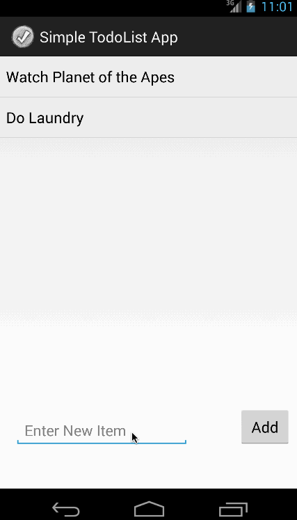

# Todo List App Demo

This is an Android demo application for displaying a todo list, deleting an item in the list by holding it for a while, and editing item by clicking on it.
All results are stored into a file when new items are added/deleted.

Completed user stories:

 * [x] Required: User can view a todo list, and add items to it.
 * [x] Required: User can delete an item in the todo list.
 * [x] Required: User can edit items in the list
 
Notes:

Walkthrough of all user stories:

GIF created with [LiceCap](http://www.cockos.com/licecap/).